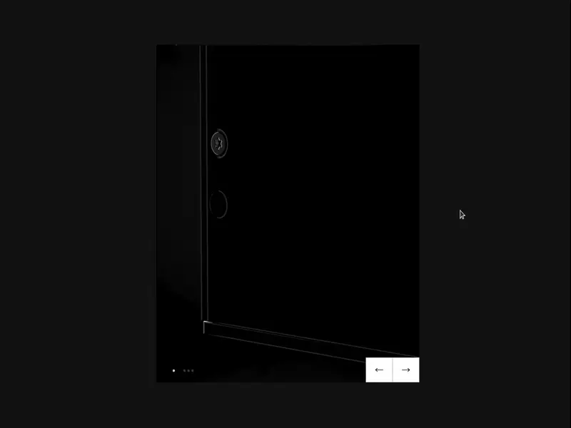

# Fullstack React Slider

In this project I created a slider component using React 17. The backend was implemented using Strapi (open source headless CMS in Node.js). It serves images to the slider component via a REST API. The React component was bootstrapped using Snowpack 3.0 (modern Webpack alternative that fully embraces ESM). The GSAP library is used for the slides' animations.

The final result can be viewed in the demo below. Alternatively, the entire project can also be deployed locally. After cloning the project, in the terminal of your choice, run `npm run strapi develop` in the main folder to start the backend and `npm start` in the client folder to start the frontend.

*Note: The GSAP package is missing from this repository due to it not being open source.*

## Demo
 file